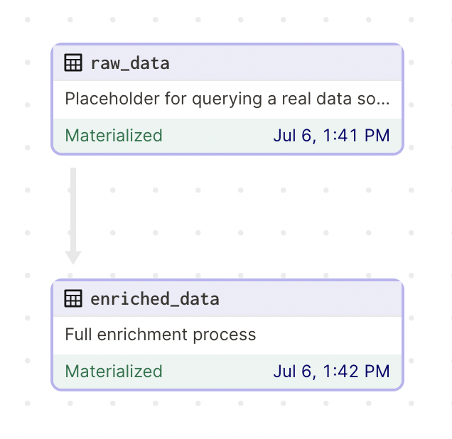
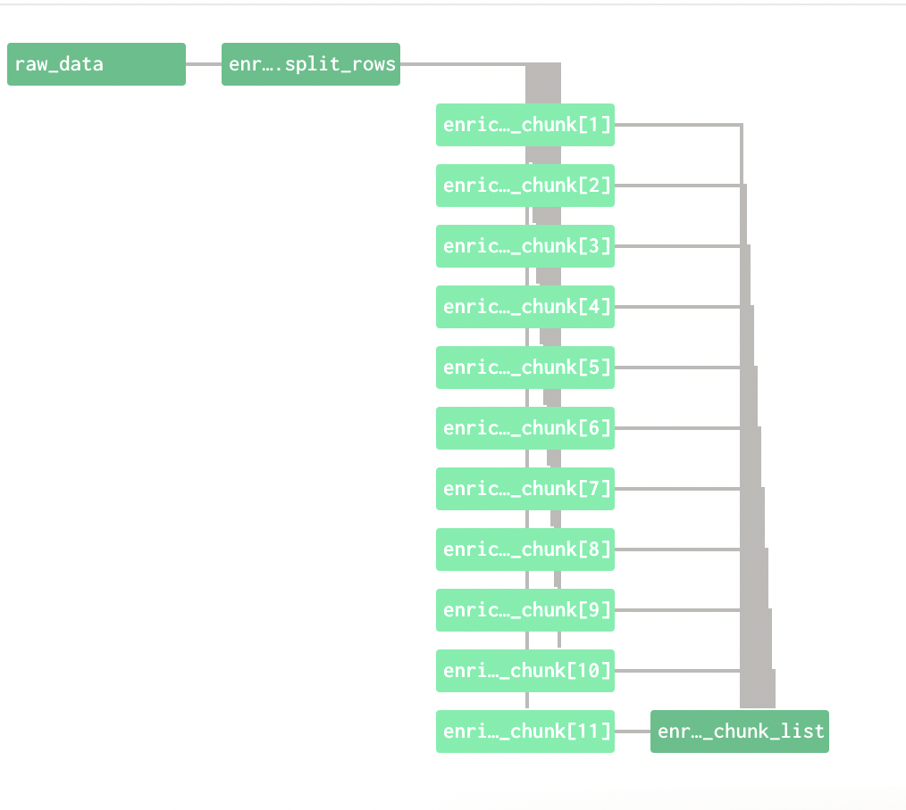
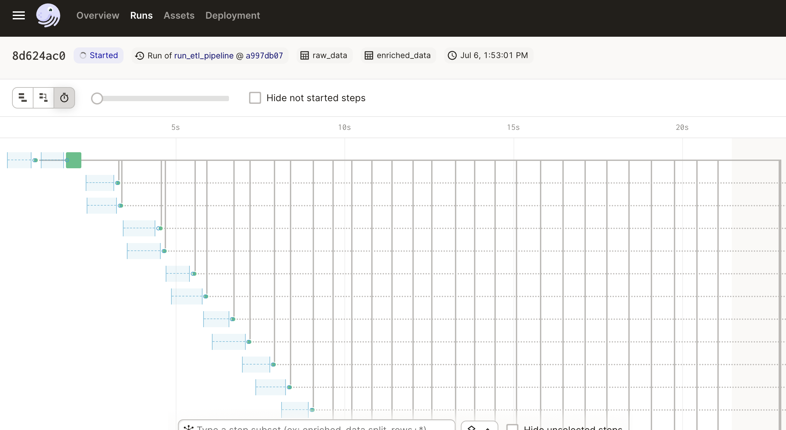

This example Dagster project shows a simple pipeline that pulls raw data from a warehouse and then uses an API to enrich that raw data.



The enrichment is done in parallel batches, constructed using a Dagster graph:




```python
@op
def split_rows(context, raw_data, config):
    """Split a data frame into batches, batch size controlled by config""" 
    ...

@op
def process_chunk(context, chunk, api):
    """Process rows in each chunk by calling the enrichment API"""
    ...

@op
def concat_chunk_list(chunks):
    """Merge the processed chunks back together"""
    ...


@graph_asset
def enriched_data(raw_data):
    """Full enrichment process"""
    chunks = split_rows(raw_data)
    chunks_mapped = chunks.map(process_chunk)
    enriched_chunks = chunks_mapped.collect()
    return concat_chunk_list(enriched_chunks)
```

The number of batches to process is a function of the raw data size and the configurable batch size. The number of batches run in parallel is configured via Dagster's [multi-process executor](https://docs.dagster.io/_apidocs/execution#dagster.multiprocess_executor).

For example, a job with smaller batches and fewer parallel runs:




To get started:

```bash
pip install -e ".[dev]"
dagster dev
```